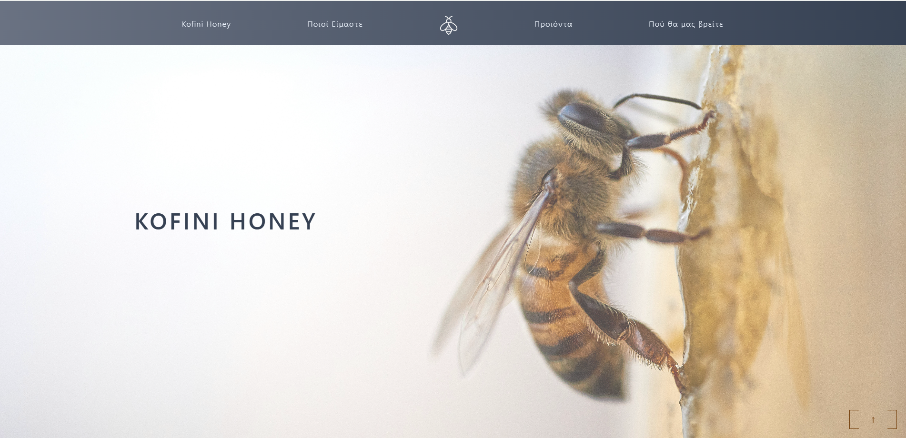
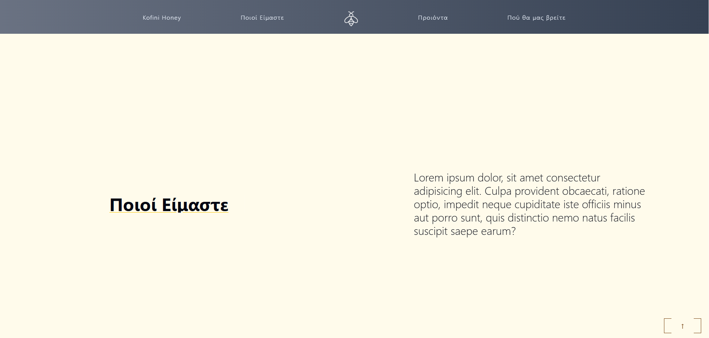
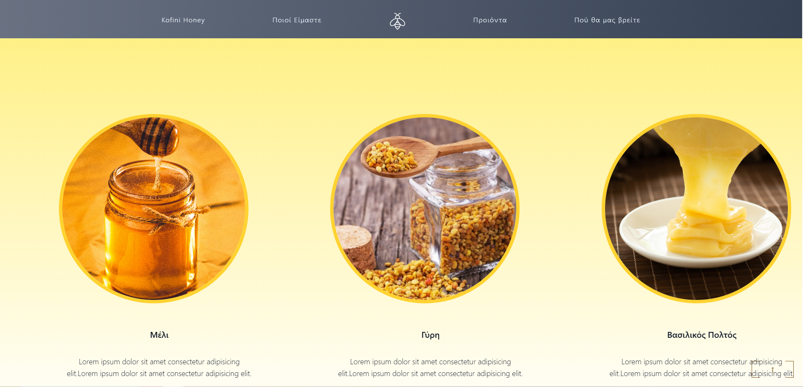
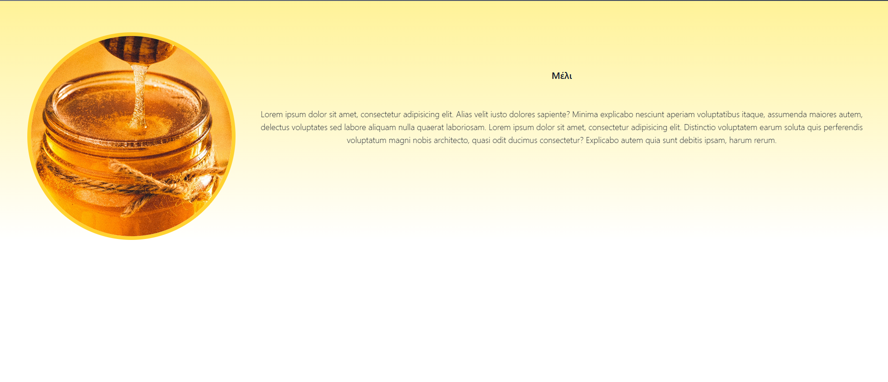

# React + TypeScript + Vite

This Project is about a branding case study of a honey producer. The project was implemented using React with Typescript and TailWind CSS for styling.
The project is not finished yet with the responsiveness feature coming soon!
Below there are some images of the Kofini Honey Page:

